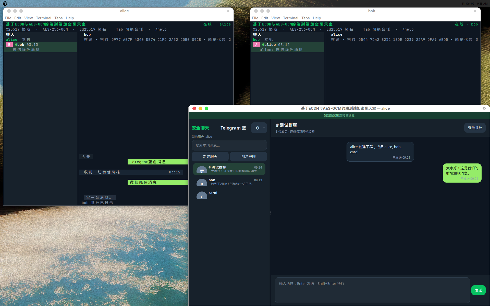
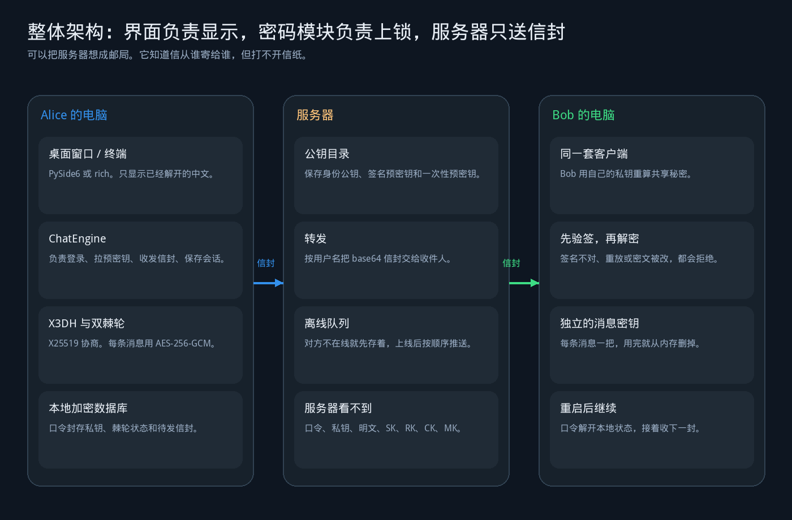
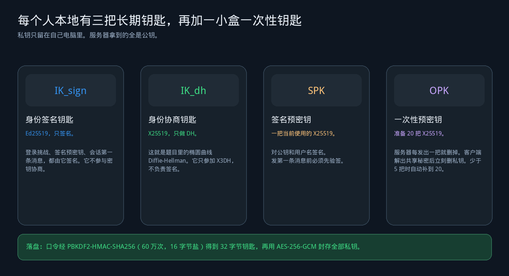
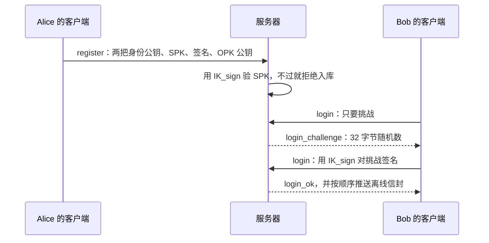
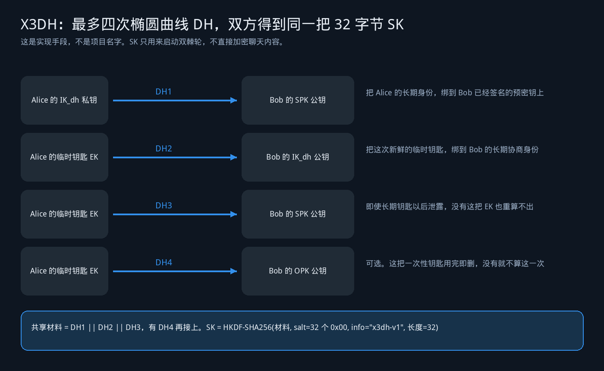
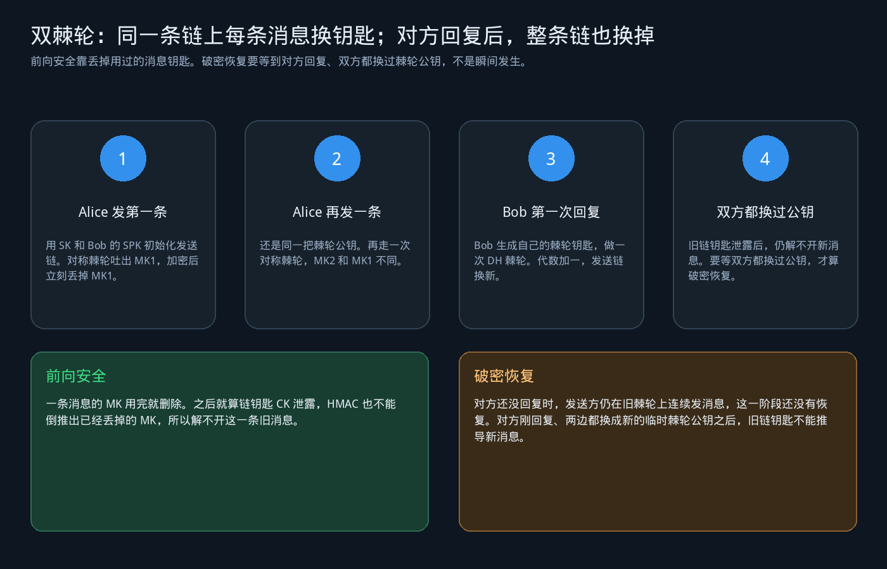
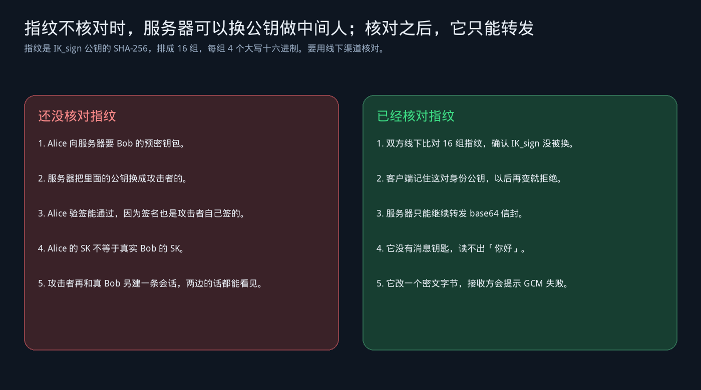

# 基于ECDH与AES-GCM的端到端加密聊天室

利用椭圆曲线Diffie-Hellman协商会话密钥，采用AES-GCM加密消息并校验完整性，结合数字签名认证身份，实现防窃听、防篡改的安全即时通讯。

X25519 就是椭圆曲线 Diffie-Hellman；每条消息用 AES-256-GCM 加密并校验完整性；Ed25519 数字签名认证身份和预密钥。X3DH 和双棘轮是把这三句话做出来的方法，写在下面的原理里，不是项目的另一个名字。

## 目录

- [先用大白话讲清楚](#先用大白话讲清楚)
- [界面长什么样](#界面长什么样)
- [五分钟跑起来](#五分钟跑起来)
- [系统是怎么分层的](#系统是怎么分层的)
- [每个人手上有哪些钥匙](#每个人手上有哪些钥匙)
- [注册和登录在证明什么](#注册和登录在证明什么)
- [第一条消息如何算出同一把 SK](#第一条消息如何算出同一把-sk)
- [为什么后面每条消息还要换钥匙](#为什么后面每条消息还要换钥匙)
- [乱序、重放和篡改](#乱序重放和篡改)
- [不核对指纹时服务器能做什么](#不核对指纹时服务器能做什么)
- [三个人的群聊是怎么加密的](#三个人的群聊是怎么加密的)
- [关掉再打开，为什么还能接着聊](#关掉再打开为什么还能接着聊)
- [两套界面，同一套引擎](#两套界面同一套引擎)
- [建议的读码顺序](#建议的读码顺序)
- [测试时应该看到什么](#测试时应该看到什么)
- [和 Signal、WhatsApp 的差别](#和-signalwhatsapp-的差别)

## 先用大白话讲清楚

把它想成微信，但中间那台服务器只是邮局。

Alice 在自己电脑上把「你好鲍勃」放进信封，用只有她和 Bob 能推导出来的钥匙封上。服务器负责把信封交给 Bob；Bob 不在线，就把信封按顺序存进抽屉，等他上线再交。服务器看得到收件人、发件人，也看得到一串 base64，但看不懂信纸上的字。日志里搜「你好鲍勃」应当没有结果。

题目里的三句话，分别落在三段代码上：

| 答辩时要说的话 | 直白意思 | 代码在哪 |
| --- | --- | --- |
| 椭圆曲线 Diffie-Hellman 协商会话密钥 | 双方各拿自己的私钥和对方的公钥做 X25519，谁也不把私钥发出去，却能算出同一段共享秘密 | `src/x3dh.py` 的四次 DH，以及 `src/double_ratchet.py` 里每次换链时的那一次 DH |
| AES-GCM 加密消息并校验完整性 | 每一条聊天记录单独用一把 32 字节消息钥匙做 AES-256-GCM。密文被改一个字节，认证标签对不上 | `src/double_ratchet.py` 的 `encrypt` / `decrypt` |
| 数字签名认证身份 | Ed25519 身份钥匙只负责签名：签预密钥、签会话的第一条消息、签登录挑战 | `src/prekeys.py`、`src/x3dh.py`、`src/client.py` 的登录 |

有一件事必须先说死：X3DH 算出的 32 字节 `SK` 只用来启动双棘轮，绝不直接拿去加密聊天内容。如果有人用一把固定的 ECDH 钥匙加密全部消息，那就没有做这个题目。

曲线运算、AES、HMAC、HKDF 全部调用 Python `cryptography`。仓库里没有自己写的曲线公式，也没有 XEdDSA。签名钥匙和协商钥匙从生成时就分开。

## 界面长什么样

桌面端是 PySide6 窗口：左边是会话，右边是气泡。自己的消息靠右，对方的消息靠左。顶上能看到对方身份指纹的前 8 组和当前双棘轮代数。主题可以在 Telegram 蓝和微信绿之间切换。



前面的窗口是 Alice 的桌面端，后面两个终端窗口是同一套协议的 rich 界面。群「测试群聊」里能看到中文消息和「已发送」。这里的「已发送」只表示服务器收下了信封，不表示对方已经阅读。

## 五分钟跑起来

需要 Python 3.11+。依赖只写在 `requirements.txt`：`cryptography`、`websockets`、`rich`、`PySide6`、`pytest`。

```bash
python3 -m pip install -r requirements.txt
```

先开服务器，再开三个客户端。演示口令一律是 `password123`。

```bash
python3 -m src.server --host 127.0.0.1 --port 8765 --db data/server.db
```

桌面端开三个窗口，分别登录 `alice`、`bob`、`carol`：

```bash
python3 -m src.gui
```

终端版对应的是：

```bash
python3 -m src.client --user alice --password password123 --host 127.0.0.1 --port 8765
python3 -m src.client --user bob --password password123 --host 127.0.0.1 --port 8765
python3 -m src.client --user carol --password password123 --host 127.0.0.1 --port 8765
```

第一次启动会在本机生成身份钥匙、签名预密钥和 20 把一次性预密钥。公钥上传，私钥留下。

Alice 和 Bob 的终端单聊：

```text
/chat bob
/fingerprint bob
你好鲍勃
```

Bob 回复 `你好爱丽丝` 时，发生第一次由回复触发的 DH 棘轮更换，界面上的棘轮代数加一。一个人先连续说几句、对方才回，更换发生在对方那一条回复上；一人一句马上回，就是第 2 条消息。

三人小群：

```text
/group create 三人组 bob carol
群里大家好
```

Bob 和 Carol 各自收到发给自己的那一封。Carol 解不开 Alice 发给 Bob 的单聊信封。

其它命令：

```text
/users
/history
/group add 三人组 新成员
/fingerprint 名字
/theme telegram
/theme wechat
/help
/quit
```

终端里直接打字回车就发送。输入框为空时，Tab 或上下键切换会话。窄终端会自动收起侧栏。

## 系统是怎么分层的



从上到下只有四层，每层有明确不能做的事。

1. **界面层**只负责看和点。桌面端在 `src/gui/`，终端端在 `src/ui.py`。Qt 主线程不计算共享秘密，也不保存链钥匙。耗时的口令派生和网络收发放在独立线程里的 asyncio 循环中，所以解锁数据库时窗口还能动。
2. **会话引擎**是 `src/client.py` 里的 `ChatEngine`。它决定何时注册、何时拉预密钥包、何时为某个朋友建立棘轮、何时把群消息拆成多封信。桌面端和终端端调用的是同一个引擎。
3. **密码模块**是 `src/x3dh.py`、`src/double_ratchet.py`、`src/prekeys.py`。这三个文件不许导入网络和数据库，输入输出都是字节，单测可以不连网。
4. **服务器**是 `src/server.py` 加 `src/store.py` 里的 `ServerStore`。它保存公钥、签名、一次性预密钥池、群成员名单和离线信封，按用户名转发。它不解析出明文。

网上跑的是带 `type` 的 JSON，单条超过 64KB 就拒绝。至少有这些类型：`register`、`login_challenge`、`login`、`upload_prekeys`、`fetch_bundle`、`envelope`、`error`。实际还会用到 `fetch_user`、`list_users`、`presence`、`group_create`、`group_add`、`group_info`、`group_update`。请求带 `request_id`，这样两个请求同时回来也不会拿错回包；聊天推送不带这个关联编号。

一条信封里给人看的头是明文的：当前棘轮公钥 `dh_pub`、本链序号 `n`、上一链发了多少条 `pn`，再加上 12 字节随机 nonce 和 base64 密文。本项目故意不再给头加一层加密，避免协议做跑偏。头公开不等于正文公开，因为没有消息钥匙就解不开 AES-256-GCM。

## 每个人手上有哪些钥匙



注册时在客户端生成，不在服务器生成。

- **IK_sign** 是 Ed25519。它像图章，只能证明「这是我签的」，不能用来和别人算出共享秘密。
- **IK_dh** 是 X25519。它像一把长期的协商钥匙，只出现在 X3DH 里。
- **SPK** 是当前这把签名预密钥，也是 X25519。图章盖的内容是 `SPK 公钥原始字节 || 用户名`，旁边记下创建时间。服务器入库前先验这个签名，验不过就拒绝注册。对方发来第一条消息前也要先验，失败时界面提示「对方预密钥签名无效」。
- **OPK** 是一次性预密钥，一开始 20 把。服务器每发给一个人就从池子里删掉那把公钥，不能再发给下一个人。接收方用对应私钥算完共享秘密，并且第一条密文认证成功之后，立刻删除这把私钥。本地剩下不到 5 把时，客户端再生成，补满 20 把，并把新公钥上传。

用户名是唯一的，只允许 3 到 20 位字母、数字和下划线。没有邮箱，也没有短信。

私钥落盘的方式固定：口令用 PBKDF2-HMAC-SHA256 做 600000 次，盐是 16 字节，得到 32 字节钥匙，再用 AES-256-GCM 加密身份私钥、SPK 私钥、还没用掉的 OPK 私钥，以及棘轮会话状态。服务器碰不到口令。

## 注册和登录在证明什么

注册不是让服务器「记住你的密码」。服务器根本没有口令。注册是在公布三样可以公开的东西：两把身份公钥，以及第一把已经签过名的 SPK，外加 OPK 公钥。服务器用 `IK_sign` 验 SPK，确认这把预密钥确实属于这个用户名。

登录是挑战应答。服务器发 32 字节随机数，客户端用 `IK_sign` 私钥签名，服务器用登记过的公钥验签。签得过，就说明连接的另一头拿着当时注册的那把身份私钥。这仍然不能代替线下核对指纹：如果第一次注册时服务器就把公钥换成了别人的，挑战应答只能证明「你拿着服务器当初收下的那把私钥」。



## 第一条消息如何算出同一把 SK

Alice 给 Bob 发这个会话的第一条消息之前，先向服务器要 Bob 的 bundle：`IK_dh`、`IK_sign`、`SPK`、SPK 签名，有剩余 OPK 就弹出一把。没有 OPK 就省略，双方少算一次 DH，但仍然要得到同一个 `SK`。

Alice 先验 SPK 签名。然后她生成一把只用这一次的临时 X25519 钥匙 `EK_A`。



四次 DH 可以记成四句人话：

- **DH1** 把 Alice 的长期协商身份绑到 Bob 签过名的预密钥上。服务器不能随便塞一把没有 Bob 签名的 SPK。
- **DH2** 把 Alice 这次新生成的临时钥匙绑到 Bob 的长期协商身份上。
- **DH3** 再让这把临时钥匙和 Bob 的 SPK 算一次。以后即使长期身份钥匙泄露，没有当时的 `EK_A`，也重算不出这一次的材料。
- **DH4** 只有拿到 OPK 才算。它让这一次握手用掉 Bob 的一把一次性钥匙。Bob 的私钥用完就删，服务器上的那把公钥也已经发过就删。

共享材料是 `DH1 || DH2 || DH3`，有 DH4 就再接上，所以长度一定是 32 的倍数。然后：

```text
SK = HKDF-SHA256(
    ikm = 共享材料,
    salt = 32 个 0x00,
    info = b"x3dh-v1",
    length = 32
)
```

Bob 不用把 Alice 的私钥要过来。他把角色对调：自己的 SPK 私钥配 Alice 的 `IK_dh` 公钥，自己的 `IK_dh` 私钥配 `EK_A` 公钥，自己的 SPK 私钥再配 `EK_A`，有 OPK 就用 OPK 私钥配 `EK_A`。两次算出的 `SK` 必须逐字节相同。单测同时覆盖「有 OPK」和「没有 OPK」。

第一条消息还附带 Alice 的 `IK_dh` 公钥、`EK_A` 公钥、用掉的 OPK 公钥（没有就是空），以及 `IK_sign` 对这几段字节的签名。Bob 先验这个签名，再核对 Alice 的身份协商公钥和服务器登记的是不是同一把。对不上就拒绝，不进入解密。

客户端第一次见过对方的两把身份公钥之后会固定下来。以后 bundle 里的身份公钥变了，提示身份密钥发生变化，拒绝覆盖已经见过的指纹。

## 为什么后面每条消息还要换钥匙

如果 `SK` 直接加密所有聊天，那么 `SK` 一旦泄露，历史和未来全都能解开。双棘轮把 `SK` 只当成启动根钥匙，后面分成两种「往前滚」：

- **对称棘轮**解决同一把棘轮公钥下面的连续消息。
- **DH 棘轮**解决「对方已经回复，双方都换了新的临时棘轮公钥」之后的恢复。

对称棘轮 `KDF_CK(ck)`：

```text
MK  = HMAC-SHA256(key = ck, msg = 0x01) 的 32 字节
新 CK = HMAC-SHA256(key = ck, msg = 0x02) 的 32 字节
```

`MK` 是这一条消息的 AES-256-GCM 钥匙。用完就从结构里删掉，不写日志。同一把 `dh_pub` 下连续两条消息只走对称棘轮，所以两把 `MK` 不同，但头里的棘轮公钥相同。

DH 棘轮 `KDF_RK(rk, dh_out)`：

```text
out = HKDF-SHA256(ikm = dh_out, salt = rk, info = b"dr-v1", length = 64)
新 RK = out 的前 32 字节
新 CK = out 的后 32 字节
```



初始化的顺序是固定的：

1. Alice 算完 `SK`，生成第一把发送棘轮钥匙 `R_A`。
2. 她计算 `X25519(R_A 私钥, Bob 的 SPK 公钥)`，再 `KDF_RK(SK, 这次 DH)`，得到根钥匙 `RK` 和发送链 `CKs`。接收链先空着。序号 `Ns`、`Nr`、`PNs` 都从 0 开始。这一步已经算一次 DH 棘轮，代数记为 1。
3. Alice 发第一条聊天消息时再做一次对称棘轮。头里 `dh_pub` 是 `R_A` 公钥，`n = 0`，`pn = 0`。
4. Bob 用自己的 SPK 私钥和头里的 `R_A` 做同样的 DH 和 `KDF_RK`，得到接收链，再按 `n` 取出 `MK` 解密。
5. Bob **第一次回复之前**才生成自己的 `R_B`。他先把当前接收链已经走到的长度记进 `PNs`，再计算 `X25519(R_B 私钥, R_A 公钥)`，用 `KDF_RK` 换出新的发送链，`Ns` 归零，代数加一。
6. Alice 收到一把没见过的 `dh_pub` 时，先把旧接收链上被跳过的序号补出来，再生成自己的下一把棘轮钥匙，做 DH 棘轮，换掉发送链。

所以「代数加一」在界面上最容易看到的时刻，是对方第一次回复到达的时候。对方还没回，Alice 可以继续用同一把 `R_A` 发很多条，那些条只换 `MK`，不换 DH 钥匙。

加密时的附加认证数据不是装饰。它把这些字段绑进 GCM 标签：

```text
发送方用户名 UTF-8
|| 接收方用户名 UTF-8
|| N 的 4 字节大端
|| PN 的 4 字节大端
|| 本方当前棘轮公钥原始字节
```

有人把密文挪到另一条会话、改序号，或者换成另一把棘轮公钥，标签都会失败。

**前向安全**讲的是过去：这条消息的 `MK` 已经丢掉。后面的链钥匙再泄露，也倒推不回这把 `MK`，因此解不开这条已经发出的消息。

**破密恢复**讲的是将来，而且不要说成「一泄露就立刻恢复」。准确的时间点是：对方刚回复，双方都换过棘轮公钥之后。旧的链钥匙推不出新的 DH 输出，也就解不开回复之后的新消息。回复发生之前，发送方还在旧链上，这一段还没有 DH 棘轮意义上的恢复。

## 乱序、重放和篡改

网络不保证先发先到。收到的序号 `n` 如果比期望序号大，就把中间那些还没到的 `MK` 算出来，放进跳过缓存。缓存键是 `dh_pub || n`，最多 40 把。再多就拒绝，避免别人发一个巨大序号，逼客户端算出成千上万把钥匙。

这 40 把里面的某一条稍后到达，就取出对应 `MK` 解密，然后立刻从缓存删除。已经成功处理过的 `(dh_pub, n)` 再出现，直接拒绝，这是防重放。不必再让 GCM 去「试试看」。

改一个密文字节，或者改 nonce、改附加数据，GCM 认证失败，界面提示「GCM 失败」。解密先在棘轮状态的副本上进行，认证成功才提交。伪造包不能把后面那条合法消息的钥匙提前烧掉。OPK 私钥也同样拖到第一条密文认证成功之后再删。

群名和消息类别除了写在外层信封，还复制进密文。解密后两边不一致就拒绝，避免服务器改了外层字段，让一条单聊在界面上伪装成群消息。

## 不核对指纹时服务器能做什么



预密钥目录放在服务器上。Alice 如果不核对 Bob 的指纹，服务器可以在 `fetch_bundle` 时把 Bob 的公钥换成攻击者的，再配上一把攻击者自己能签过的 `IK_sign`。Alice 会和攻击者算出 `SK`；攻击者再去和真实的 Bob 另建一条会话。两边看到的中文都是攻击者转发的。这就是中间人。

指纹是 `IK_sign` 公钥的 SHA-256，显示成 16 组，每组 4 个大写十六进制。桌面端点「身份指纹」，终端用 `/fingerprint 名字`。双方用线下渠道核对。核对过之后，服务器再换公钥会被客户端拒绝。从此它只能转发信封：没有 `MK`，读不出正文；改一个字节，接收方 GCM 失败。

`scripts/demo_attack.py` 在内存里演示这件事，不需要连网：

```bash
python3 scripts/demo_attack.py
```

它会打印：诚实 bundle 下 Alice 和 Bob 的 `SK` 相同；公钥被掉包后，Alice 的 `SK` 不等于真实 Bob，却等于攻击者重算的 `SK`。

## 三个人的群聊是怎么加密的

群最多 8 个人。一条群消息不是「大家共用一把发送钥匙」，而是 Alice 对 Bob 跑一遍她和 Bob 的双棘轮，再对 Carol 跑一遍她和 Carol 的双棘轮，发出 2 封信封。服务器按收件人分发。Bob 只能解开写着给 Bob 的那封，Carol 只能解开写着给 Carol 的那封。

所以群和单聊用的是同一套棘轮。人数增加，信封数量线性增加，因此限制 8 人。这不是 WhatsApp 的 Sender Keys，也不是 MLS。答辩时要讲清楚：没有「一条发送链、全群共用」的优化。

`/group add 群名 新成员` 只能由已经在群里的人发起。新成员只进入之后的新消息；旧消息不会补发给他，因为他没有那些已经丢掉的消息钥匙。

## 关掉再打开，为什么还能接着聊

客户端 SQLite 里有两块不同的数据。

- 历史正文、未读数、主题和当前会话是界面状态，留在本机，方便搜索和重开窗口。搜索只查本机已经解开的历史，用参数化 `LIKE`，不会把明文发给服务器。
- 身份私钥、棘轮里的 `RK`、链钥匙、棘轮私钥、跳过的 `MK`，以及还没确认发出去的信封，都放进口令加密的 blob。

发送时先把「推进后的棘轮状态」和「完整信封」放进同一个数据库事务。如果程序在发出去之前崩溃，下次登录会重发原来那封，而不是再推进一次棘轮、做出一封 Bob 无法对上序号的新信。桌面端会把这种消息显示成发送中、已发送或失败。失败可以看见原因，例如验签失败、重放拒绝、GCM 失败。

服务器进程重启后，SQLite 里的用户公钥、SPK、剩余 OPK 和离线信封还在。客户端重启后，用同一个口令解开棘轮，可以继续收下一封。离线消息按入队顺序推送，推成功一封删一封，避免半路断开后整段队列丢失或重复删除。

## 两套界面，同一套引擎

| | 桌面端 | 终端端 |
| --- | --- | --- |
| 启动 | `python3 -m src.gui` | `python3 -m src.client --user 名字 --password 口令` |
| 界面 | PySide6。侧栏、气泡、搜索、主题动画 | rich 双栏。窄屏幕自动变成单栏 |
| 发送 | Enter 发送，Shift+Enter 换行。先在气泡里显示「发送中」 | 输入一行回车发送 |
| 安全提示 | 红色安全气泡和顶部连接条 | 红色的「验签失败 / 重放拒绝 / GCM 失败」 |
| 密码协议 | 不单独实现，调用 `ChatEngine` | 同一个 `ChatEngine` |

桌面端断线后会自动重连。重连成功只补发还留在加密 outbox 里的原始信封。群消息的扇出如果只成功了一部分，历史里会留下「送达了几个收件人」，不会假装全员都收到了。

## 建议的读码顺序

答辩前按这个顺序读，每一段都能指着文件讲：

| 顺序 | 文件 | 读它是为了讲清什么 |
| --- | --- | --- |
| 1 | `src/x3dh.py` | 四次 X25519、HKDF 标签 `x3dh-v1`、初始消息签名 |
| 2 | `src/double_ratchet.py` | `0x01` / `0x02`、`dr-v1`、AES-256-GCM、40 条跳过上限、原子提交 |
| 3 | `tests/test_x3dh.py`、`tests/test_double_ratchet.py` | 双方 `SK` 相同、回复后代数加一、乱序、重放、篡改 |
| 4 | `src/prekeys.py` | 三把长期钥匙分离，OPK 用完即删，少于 5 把补到 20 |
| 5 | `src/protocol.py` | 信封、指纹、64KB、用户名规则 |
| 6 | `src/server.py` | 验签后才入库、OPK 只发一次、离线队列、日志不出现明文 |
| 7 | `src/store.py` | PBKDF2 600000 次和 AES-256-GCM 封存 |
| 8 | `src/client.py` | 把上面的零件串成注册、登录、单聊和群扇出 |
| 9 | `src/gui/` | 展示层。可以最后看，它不改变密码协议 |

更完整的课程报告在 [REPORT.md](REPORT.md)。报告标题和摘要与本文件相同，正文按答辩口径写了前向安全、破密恢复和中间人。

## 测试时应该看到什么

```bash
python3 -m pytest -q
```

不连网的单测覆盖：

- 有 OPK 和没有 OPK 时，双方 `SK` 完全一致
- 往返各 3 条，明文一致
- 同一把 `dh_pub` 下两条消息的 `MK` 不同
- 回复后 DH 棘轮代数加一，更换前后 `MK` 不同
- 故意打乱到达顺序仍能解开
- 同一封再放一次被拒绝
- 改一个密文字节，GCM 失败，而且失败不会破坏后续合法消息
- 中间跳过超过 40 条被拒绝
- 换到新 DH 链之后，旧链里按 `PN` 缓存过的迟到消息仍能解开

联网测试覆盖中文单聊、离线队列、三人群、Carol 解不开 Alice 给 Bob 的信封、重放和篡改。存储测试覆盖口令重新解开棘轮后继续解密。

手测时可以用三台客户端确认四件事：服务器终端搜不到那句中文；改密文字节和重放都会被接收方拒绝；回复那一条让棘轮代数增加；重启服务器后公钥和离线信封还在，重启客户端后口令能解开状态并继续收。

## 和 Signal、WhatsApp 的差别

本仓库按课程步骤自己把协议拼起来，没有使用 libsignal 或别的现成棘轮库。和那两套产品相比，故意没做这些：

- **没有多设备。** 一台客户端一份加密数据库，新手机不能把旧链同步过去。
- **没有 PQXDH。** 没有 Kyber 之类的后量子握手。
- **没有密封发送者。** 信封上的发送方和接收方是明文，服务器知道谁在和谁通信，只是不知道正文。
- **没有头加密。** `dh_pub`、`n`、`pn` 可以直接看见。
- **群不是 Sender Keys。** 收件人增加，独立双棘轮也增加，所以最多 8 人。
- **身份钥匙不是 XEdDSA。** Ed25519 只签名，X25519 只做 Diffie-Hellman。

KDF 标签和题目一致：`x3dh-v1`、`dr-v1`、HMAC 的 `0x01` / `0x02`，附加数据是用户名和 4 字节大端序号。没有协议偏离需要单独解释。
